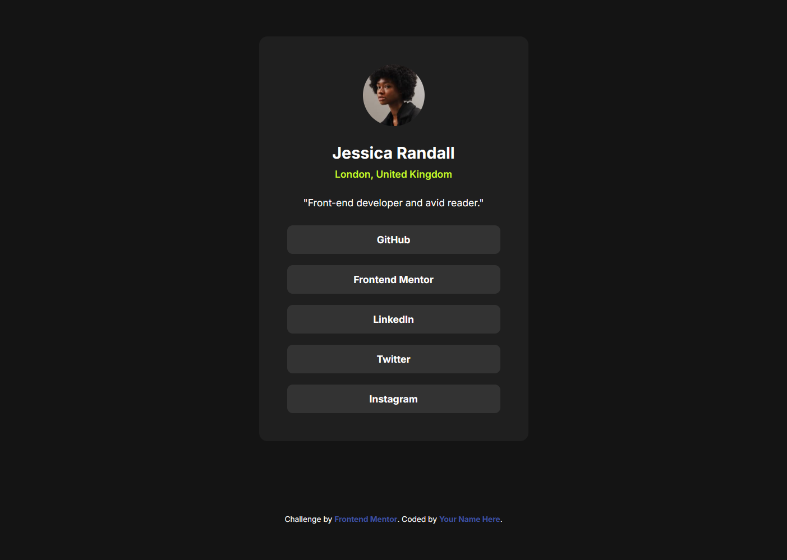
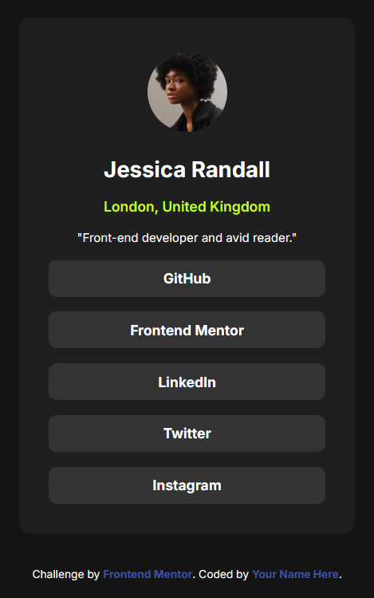

# Frontend Mentor - Social Links Profile

This is my solution to the [Social links profile challenge on Frontend Mentor](https://www.frontendmentor.io/challenges/social-links-profile-UGm2K03D6).

## Overview

### The challenge

The goal was to build a social links profile card and get it looking as close to the design as possible.

### Screenshots

#### Desktop

#### Mobile

### Links

- Solution URL: https://github.com/ManuelDiSab/Frontend-Mentor-Social-link-profile
- Live Site URL: https://frontendmentorsociallinkprofilebymds.netlify.app/

## My Process

### Built with

- Semantic HTML5 markup
- CSS Custom Properties (Variables)
- Flexbox
- CSS Grid (for centering the layout)
- Mobile-first approach
- Hover states with smooth transitions

## Author

- Frontend Mentor - [@ManuelDiSab](https://www.frontendmentor.io/profile/ManuelDiSab)
- GitHub - [ManuelDiSab](https://github.com/ManuelDiSab)
